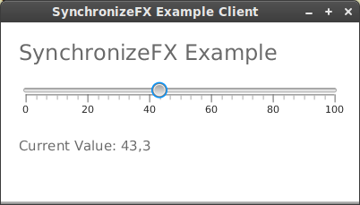

#Slider Demo
This demo project shows the usage of **SynchronizeFX** in a Client-Server scenario.
It consists of a small server application that has a simple domain model with a double property.

The client application shows a slider control that is synchronized between all clients.

## Step by Step

### View

At first we want to implement a small view that contains a slider control and a label that shows the current value of the slider.
Our view class extends from VBox so that it can be placed inside the SceneGraph of JavaFX.

	public class View extends VBox {
		
		private final Slider slider;	
		
		public View() {
			this.setSpacing(20);
			this.setPadding(new Insets(20));

			final Text header = TextBuilder.create().text("SynchronizeFX Example").fill(Color.DIMGRAY)
				.style("-fx-font-size:24").build();

			slider = SliderBuilder.create().min(0).max(100).showTickLabels(true).showTickMarks(true)
				.majorTickUnit(20).minorTickCount(5).snapToTicks(true).build();

			final Label valueLabel = LabelBuilder.create().textFill(Color.DIMGRAY).style("-fx-font-size:15").build();

			valueLabel.textProperty().bind(Bindings.format("Current Value: %1$.1f", slider.valueProperty()));

			this.getChildren().addAll(header, slider, valueLabel);
		}

		public DoubleProperty sliderValue(){
			return slider.valueProperty();
		}
	}

We are using the builder's of JavaFX to create our view controls. For the *valueLabel* we create a small
custom binding so that it shows the current value of the slider in a convenient way. 
The slider control is a member variable so that we can make the value property of the slider available from the outside.

The view class is placed in the package *'synchronizefx.sliderdemo.client'*.

Now we need to create and JavaFX application entry point that shows our *View* class so we create the class *ClientApp* in the same package. This new class extends from *Application* and contains a main method that starts the JavaFX application. 

In the *start* method we create an instance of our *View* class and put it into the SceneGraph.

	public class ClientApp extends Application {	
		public static void main(String ... args) {
			Application.launch(args);
		}

		@Override
		public void start(final Stage stage) throws Exception {
			stage.setTitle("SynchronizeFX Slider Example");

			final View view = new View();

			stage.setScene(new Scene(view, 400,200));

			stage.show();
		}
	}

The picture below shows our client application.

### Presentation Model

At the moment our view doesn't do anything at all. To implement the synchronization of the slider value we need to define a
presentation model. The presentation model is a simple Java class that contains all properties that are representing the current
state of the UI. In our usecase it's a *DoubleProperty* that holds the current value of the slider. We follow the JavaFX Beans convention and create a getter and setter plus the property accessor named 'sliderValueProperty()'.

**Please note:* We are implementing a client-server scenario. We have one server and multiple clients that all share the same
presentation model. The synchronization is done through the server and for this reason the presentation model is part of the server. 

	public class Model {

    		private final DoubleProperty sliderValue = new SimpleDoubleProperty();

    		public DoubleProperty sliderValueProperty() {
       			return sliderValue;
    		}

    		public void setSliderValue(final double value) {
        			sliderValue.set(value);
    		}

    		public double getSliderValue() {
        			return sliderValue.get();
    		}
	}

We place this class in a package *'synchronizefx.sliderdemo.server'*.

### The server application

Our server application will be a simple class *'ServerApp'* with a main method. The first thing we 
need to do is to create an instance of the presentation model. This will be the main instance that all clients are synchronized with. After that we use the *SynchronizeFxBuilder* to create a server instance that is handling our presentation model. We need
to define a *ServerCallback* that is used for error handling when something went wrong with the networking.

After we have started the server we create a while loop that is waiting for the user to press 'q' to shutdown the server.

	public class ServerApp {

		public static void main(final String... args) {
			System.out.println("starting server");
			final Model model = new Model();

			final SynchronizeFxServer syncFxServer = SynchronizeFxBuilder.create().buildServer(model,
				new ServerCallback() {
					@Override
					public void onError(final SynchronizeFXException exception) {
						System.out.println("Server Error:" + exception.getLocalizedMessage());
					}
				});

			syncFxServer.start();

			final Scanner console = new Scanner(System.in);
			boolean exit = false;

			while (!exit) {
				System.out.println("press 'q' for quit");
				final String input = console.next();

				if ("q".equals(input)) {
					exit = true;
				}
			}

			console.close();
			syncFxServer.shutdown();
		}
	}

### Connect the client with the server

The last step we need to do is to connect our *ClientApp* with the server and enable the synchronization of the presentation model.

At first we create a member variable of our presentation model. In the *start* method we use the *SynchronizeFxBuilder* to create our client of type *SynchronizeFxClient*. The builder method needs a server name as String and a *ClientCallback*. The server name can be an ip address or a DNS name or, like in our example, 'localhost'. 

Like the *ServerCallback* the *ClientCallback* has method to handle errors and to handle a disconnect from the server. More interesting is the *modelReady* method. This method is called when the presentation model is fully transferred from the server to the client and is ready to be used. First we need to cast it to our presentation model type and assign it to our member variable. After that we can initiate the binding of the view components to the presentation model.

In our case we bidirectionally bind the 'sliderValue' property of the *View* class to the 'sliderValueProperty' of our presentation model.

The last thing we need to do is to call the 'connect' method of the SynchronizeFxClient and handle the disconnection when the client application is closed. 

Now the full ClientApp class looks like this:

	public class ClientApp extends Application {
		private final static String SERVER = "localhost";

		private Model model;

		private SynchronizeFxClient client;

		public static void main(final String... args) {
			Application.launch(args);
		}

		@Override
		public void start(final Stage stage) throws Exception {
			stage.setTitle("SynchronizeFX Example Client");
			final View view = new View();
			stage.setScene(new Scene(view, 400, 200));

			client = SynchronizeFxBuilder.create().buildClient(SERVER, new ClientCallback() {
				@Override
				public void modelReady(final Object object) {
					model = (Model) object;

					view.sliderValue().bindBidirectional(model.sliderValueProperty());
				}

				@Override
				public void onError(final SynchronizeFXException exception) {
					System.out.println("Client Error: " + exception.getLocalizedMessage());
				}

				@Override
				public void onServerDisconnect() {
					System.out.println("Server disconnected");
				}
			});

			client.connect();

			stage.show();
		}

		/**
		 * Disconnect the client when the application is closed.
		 */
		@Override
		public void stop() {
			System.out.print("Stopping the client...");
			client.disconnect();
			System.out.println("done");
		}
	}

Thats all. To view our example in action we need to first start our server. After that we can start two or more clients that are all connected to our server. When we change the slider of one of the clients, all other clients are synchronized automatically. 

